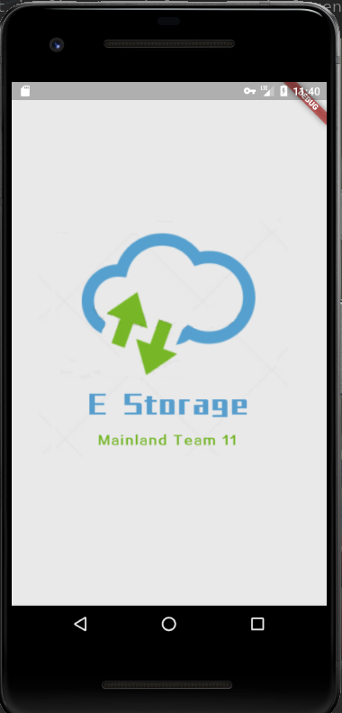
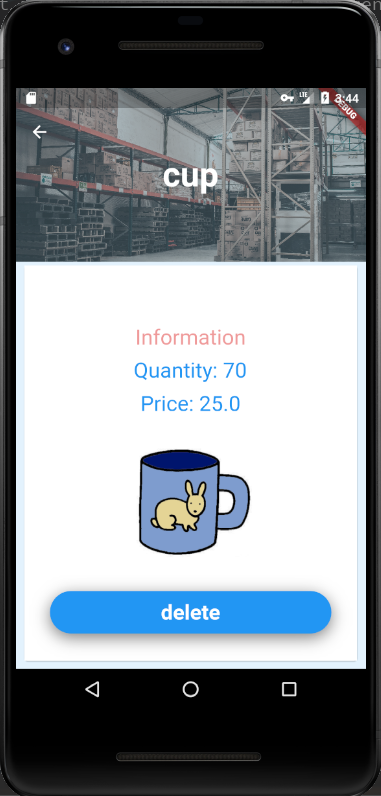

The project implements an inventory management flutter app. This is the backend repository. For frontend flutter repository, please click [here](https://github.com/Cookiefan/google_sps_flutter).

### startup logo

### homepage

### check detailed information or delete commodity

### add new commodity

